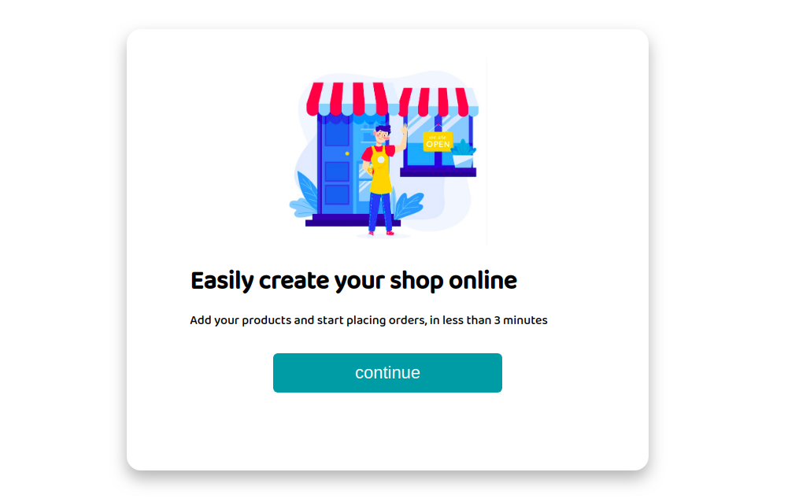

# shop_manager v1.0 - React & Flask

Easy to build Shop Manager, with this platform you can create your e-commerce solution fast.

Screenshots
-----------

At first you get a welcome screen



then you can choose if creating a new shop or access 
your previous created account


start creating a product and a category

 


Now create your shop


And setup your account credentials


Then you are ready to start placing orders


Features
--------

- Create your online Shop
- Create Categories and Products
- Manage Orders
- Manage Clients
- Manage Providers

Requirements (development environment)
----------------------------------

- Docker & docker-compose

The Dockerfiles handle the boring stuff

- Python3.8.1
- Flask
- SQLAlchemy
- MicrosoftSQL Server (ODBC Driver 17 for SQL Server)
- Npm
- React.js

Build Up
--------

My recomendation, first build the sqlserver, then up and build everything else

```
# docker-compose up --build --force-recreate -d sqlserver
```

To start the API the SqlServer and the Web Client

```
$ sudo docker-compose up --build -d
```

check your [localhost](http://localhost)

Note: 

if the port 80 is in use, please stop it and run the docker-compose again

You can also check the API Architecture at [apidocs](http://localhost:8080/apidocs)

Test
----
to test the DBEngine run the unittest
```
# Connect to the API container

$ sudo docker exec -it shop_manager_api_1 bash
root@123:/usr/src/app# python3 -m unittest discover
```

Other tools
-----------

Check the console.py in action
Take all the services up, then...

```
$ sudo docker exect -it shop_manager_api_1 bash
root@123:/usr/src/app# python3 console.py
Driver:
ODBC Driver 17 for SQL Server
Welcome to Shop Manager Shell!
(shpmngr) 
```

Start by checking the commands

```
(shpmngr) help
Documented commands (type help <topic>):
========================================
all  create  delete_all  ex  exit  help  printdb  show

(shpmngr) 
```
To show all the tables

```
(shpmngr) printdb
db_shop TABLES:
dict_keys(['User', 'Product', 'Category', 'Shop', 'CachedUser', 'Order', 'Client'])
(shpmngr) 
```

Create a new instance

```
(shpmngr) create User username:"dnart@mail.com" passwd:1234
['username:"dnart@mail.com"', 'passwd:1234']
username "dnart@mail.com"
passwd 1234

```

get all instances from a TABLE

```
(shpmngr) all User
User instances:
63cf260e-b49f-41e6-a82b-39876f5561c6
(shpmngr) 

# Now check the data in one instance
(shpmngr) show User 63cf260e-b49f-41e6-a82b-39876f5561c6
['User', '63cf260e-b49f-41e6-a82b-39876f5561c6']
{'updated_at': '2020-09-28T18:09:43.410000', 'id': '63cf260e-b49f-41e6-a82b-39876f5561c6', 'username': '"dnart@mail.com"', 'created_at': '2020-09-28T18:09:43.410000', 'passwd': '1234'}
(shpmngr)
```

take a look at the "help <command>" command for each function available.

Issues and still active Features
------

issues:

- Products images persistance fails
- Login in WebApp needs a fix, may be due to a db_data persistance issue
- Authorization flow need to redirect when the component receives an error code from the API
- 

active development features:

- Shop settings and Shop info Components are required by the WebApp
- Order details Component is required by the WebApp
- Provider Component is required